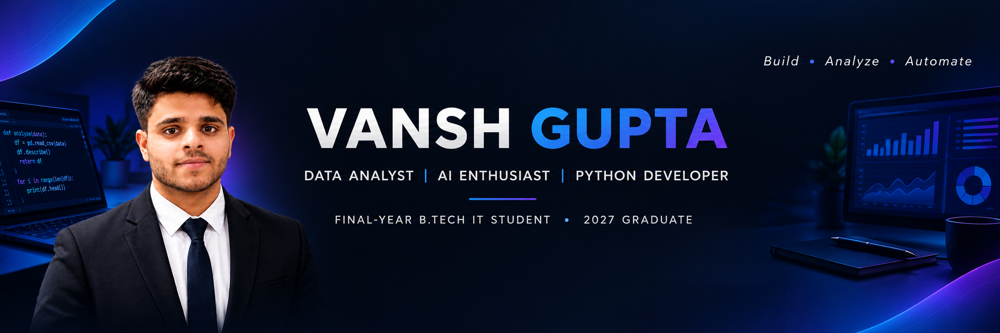

 

Hi 👋, I'm Vansh Gupta

Data Analyst | AI Enthusiast | Python Developer

Final-Year B.Tech IT Student • 2027 Graduate

👨‍💻 About Me

I'm Vansh Gupta, a final-year B.Tech Information Technology student with a strong interest in Data Analytics, Artificial Intelligence, Python Development, and Web Development.

I enjoy building practical projects that solve real-world problems and continuously improving my skills through hands-on development.

🎓 B.Tech – Information Technology, Ambalika Institute of Management and Technology (AIMT)

📅 2023 – 2027

📊 CGPA: 84.52%

🐍 Python Developer

🤖 AI & GenAI Enthusiast

📈 Data Analytics

🌐 Web Development

🚀 Interested in building useful AI-powered products

🛠️ Tech Stack

  

🚀 Featured Projects

📄 AI Resume Analyzer

AI-powered resume analysis system that evaluates resumes against job descriptions and provides ATS-style insights, skill-gap analysis, and improvement suggestions.

Tech: Python • Flask • MongoDB • Gemini AI

🤖 AI Interview Copilot

An AI-powered mock interview platform designed to simulate an interview experience and provide performance feedback and analytics.

Tech: Python • Flask • Gemini AI • WebRTC

🌐 Personal Portfolio

My personal portfolio website showcasing my skills, projects, education, and developer profile.

🖼️ Project & Profile Showcase

🎓 Education

Ambalika Institute of Management and Technology (AIMT)
B.Tech – Information Technology | 2023 – 2027
CGPA: 84.52%

Qualification

Score

Class 12

82.6%

Class 10

82.5%

📊 GitHub Activity

  

  

🌐 Connect With Me

💡 Build • Analyze • Automate • Grow

Thanks for visiting my profile! 🚀

